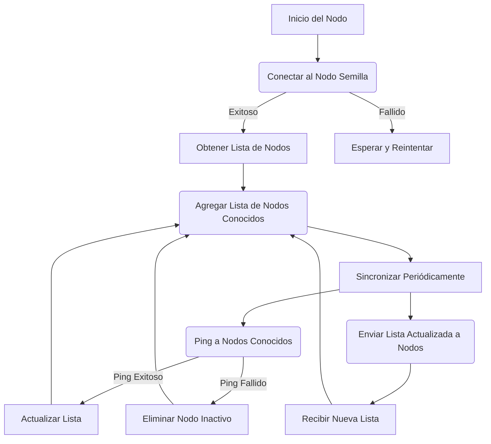

Idea: sistema totalmente distribuido para aprender cómo funciona un sistema sin una central.<!--more-->

# Idea

Multiples proyectos que implementan la misma interfaz para conocerse unos a otros y poder decis a quiénes conoce.

# ¿Qué debe hacer un sistema?

- Debe implementar todo lo necesario para descubrir los demás componentes (Nodos) en la red.
- Debe poder listar todos los Nodos en la red.

# Definición

## Peer

### Inicio del Nodo

El nodo inicia su proceso.

### Conectar al Nodo Semilla

Intenta conectarse al nodo semilla para obtener la lista inicial de nodos.

### Obtener Lista de Nodos

Si tiene éxito, agrega los nodos conocidos a su lista.

### Sincronizar Periódicamente

Establece una sincronización periódica para comunicarse con otros nodos.

### Ping a Nodos Conocidos

Verifica si los nodos están activos.

### Enviar Lista Actualizada

Comparte la lista actualizada con otros nodos.

### Actualizar o Eliminar Nodos

Actualiza la lista con nuevos nodos o elimina nodos inactivos.



# Startup de cada Nodo

## Inicio de la aplicación:

El nodo inicializa el servidor Express y configura los endpoints necesarios (`/nodes`, `/ping`).

## Conexión al nodo semilla:

El nodo intenta conectarse al nodo semilla para obtener la lista de nodos conocidos.

- Si la conexión es exitosa:
  Recibe la lista de nodos del nodo semilla.
  Agrega los nodos recibidos a su lista local de nodos conocidos.
- Si la conexión falla:
  Muestra un error en consola.
  Reintenta la conexión automáticamente en el siguiente ciclo de sincronización.

## Registrar otros nodos:

Al recibir una solicitud POST `/nodes` de un nuevo nodo:

- Agrega el nodo a la lista de nodos conocidos si aún no está.
- Retorna la lista actualizada al nuevo nodo.

## Sincronización periódica (cada 30 segundos):

Envía solicitudes GET `/nodes` a todos los nodos conocidos.
Recibe y fusiona las listas de nodos, eliminando duplicados.
Si no puede contactar a un nodo, lo marca como inactivo en consola, pero mantiene su URL por si vuelve a estar disponible.

## Verificación de actividad de nodos:

Otros nodos pueden verificar si este nodo está activo mediante el endpoint GET `/ping`.
Retorna una respuesta indicando que el nodo está activo.

## Respuesta a solicitudes de otros nodos:

- GET `/nodes`: Retorna la lista actual de nodos conocidos.
- POST `/nodes`: Registra nuevos nodos.
- GET `/ping`: Indica que el nodo está funcionando.

# Ejemplo en Javascript

```Javascript
// Importar dependencias
const express = require('express');
const fetch = require('node-fetch');

// Inicializar la aplicación Express
const app = express();
app.use(express.json());

let knownNodes = []; // Lista en memoria de nodos conocidos
const seedNodeUrl = "http://localhost:3000"; // Nodo semilla

// Función para conectarse al nodo semilla
async function connectToSeedNode() {
  try {
    const response = await fetch(`${seedNodeUrl}/nodes`);
    const nodesFromSeed = await response.json();
    knownNodes = [...new Set([...knownNodes, ...nodesFromSeed])];
    console.log("Conectado al nodo semilla y sincronizado.");
  } catch (error) {
    console.error("No se pudo conectar al nodo semilla:", error.message);
  }
}

// Sincronizar nodos conocidos periódicamente
function syncNodes() {
  knownNodes.forEach(async (nodeUrl) => {
    try {
      const response = await fetch(`${nodeUrl}/nodes`);
      const newNodes = await response.json();
      knownNodes = [...new Set([...knownNodes, ...newNodes])];
    } catch (error) {
      console.error(`Error sincronizando con el nodo ${nodeUrl}: ${error.message}`);
    }
  });
}
setInterval(syncNodes, 30000); // Ejecutar cada 30 segundos

// Endpoint GET /nodes - Retorna la lista de nodos
app.get('/nodes', (req, res) => {
  res.json(knownNodes);
});

// Endpoint POST /nodes - Registra un nuevo nodo
app.post('/nodes', (req, res) => {
  const { nodeUrl } = req.body;
  if (!knownNodes.includes(nodeUrl)) {
    knownNodes = [...knownNodes, nodeUrl];
  }
  res.status(201).json({ message: 'Nodo agregado', knownNodes });
});

// Endpoint GET /ping - Verifica si el nodo está activo
app.get('/ping', (req, res) => {
  res.json({ message: 'Nodo activo' });
});

// Iniciar el servidor en el puerto 3000
const PORT = process.env.PORT || 3000;
app.listen(PORT, () => {
  console.log(`Servidor corriendo en puerto ${PORT}`);
  connectToSeedNode(); // Conectar al nodo semilla al iniciar
});
```
